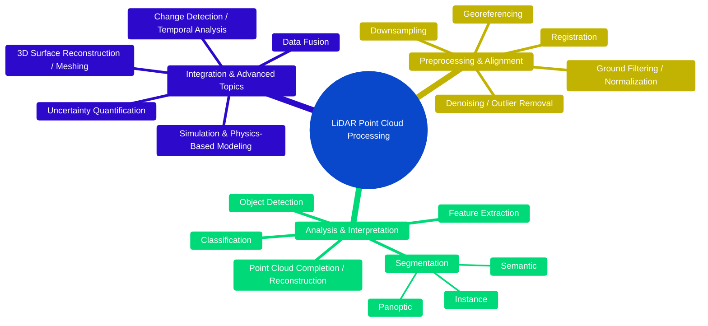
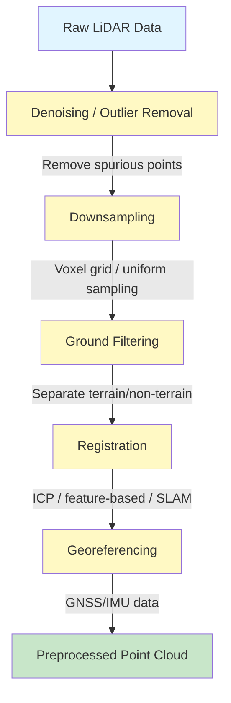
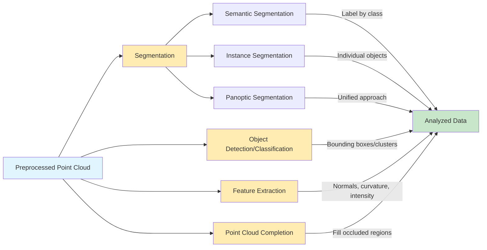
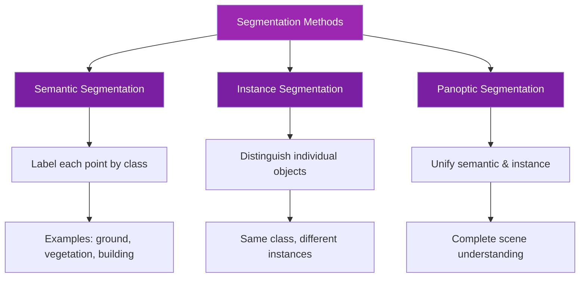
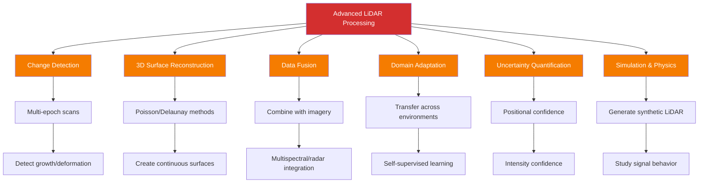
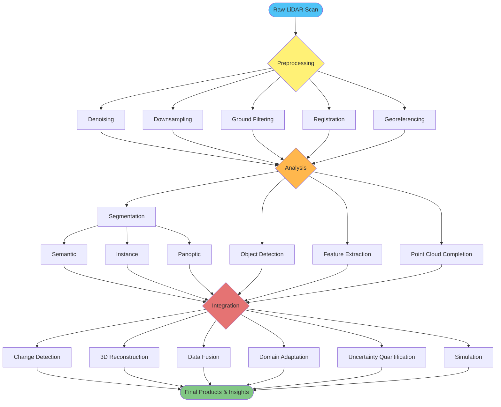

# LiDAR Point Cloud Processing - Brain Plot

## Main Overview Diagram

## Detailed Preprocessing & Alignment Flow

## Analysis & Interpretation Pipeline

## Segmentation Techniques Breakdown

## Integration & Advanced Topics Network

## Complete Processing Workflow

## Hierarchical Technique Organization

```mermaid
graph TD
    Root[LiDAR Point Cloud Processing Techniques]
    
    Root --> Cat1[1️⃣ Preprocessing & Alignment]
    Root --> Cat2[2️⃣ Analysis & Interpretation]
    Root --> Cat3[3️⃣ Integration & Advanced Topics]
    
    Cat1 --> C1T1[Denoising / Outlier Removal]
    Cat1 --> C1T2[Downsampling]
    Cat1 --> C1T3[Ground Filtering / Normalization]
    Cat1 --> C1T4[Registration]
    Cat1 --> C1T5[Georeferencing]
    
    C1T1 --> |Purpose| C1T1a[Remove spurious points<br/>from mixed pixels/noise]
    C1T2 --> |Methods| C1T2a[Voxel grid<br/>Uniform sampling]
    C1T3 --> |Goal| C1T3a[Separate terrain from<br/>non-terrain objects]
    C1T4 --> |Approaches| C1T4a[ICP<br/>Feature-based<br/>SLAM methods]
    C1T5 --> |Using| C1T5a[GNSS/IMU data]
    
    Cat2 --> C2T1[Segmentation]
    Cat2 --> C2T2[Object Detection / Classification]
    Cat2 --> C2T3[Point Cloud Completion]
    Cat2 --> C2T4[Feature Extraction]
    
    C2T1 --> C2T1a[Semantic]
    C2T1 --> C2T1b[Instance]
    C2T1 --> C2T1c[Panoptic]
    C2T1a --> |Output| C2T1a1[Label each point by class]
    C2T1b --> |Output| C2T1b1[Distinguish individual objects]
    C2T1c --> |Output| C2T1c1[Unify semantic & instance]
    
    C2T2 --> |Output| C2T2a[Bounding boxes or clusters]
    C2T3 --> |Goal| C2T3a[Fill occluded regions<br/>Recover missing geometry]
    C2T4 --> |Compute| C2T4a[Normals<br/>Curvature<br/>Intensity<br/>Shape descriptors]
    
    Cat3 --> C3T1[Change Detection / Temporal Analysis]
    Cat3 --> C3T2[3D Surface Reconstruction]
    Cat3 --> C3T3[Data Fusion]
    Cat3 --> C3T4[Domain Adaptation]
    Cat3 --> C3T5[Uncertainty Quantification]
    Cat3 --> C3T6[Simulation & Physics-Based Modeling]
    
    C3T1 --> |Method| C3T1a[Compare multi-epoch scans<br/>Detect growth/deformation]
    C3T2 --> |Techniques| C3T2a[Poisson<br/>Delaunay<br/>Meshing]
    C3T3 --> |Combine| C3T3a[LiDAR + Imagery<br/>Multispectral<br/>Radar data]
    C3T4 --> |Goal| C3T4a[Transfer models<br/>Self-supervised learning]
    C3T5 --> |Assess| C3T5a[Positional confidence<br/>Intensity confidence]
    C3T6 --> |Purpose| C3T6a[Generate synthetic LiDAR<br/>Study signal behavior]
    
    style Root fill:#1976d2,color:#fff
    style Cat1 fill:#43a047,color:#fff
    style Cat2 fill:#fb8c00,color:#fff
    style Cat3 fill:#e53935,color:#fff
```

## Usage Notes

- **Mindmap Diagram**: Best for high-level overview and brainstorming
- **Flow Diagrams**: Show sequential processing steps and dependencies
- **Hierarchical Graph**: Complete technique breakdown with details
- **Network Diagram**: Shows interconnections between advanced topics

To render these diagrams, use online tools like [Mermaid Live Editor](https://mermaid.live/)

